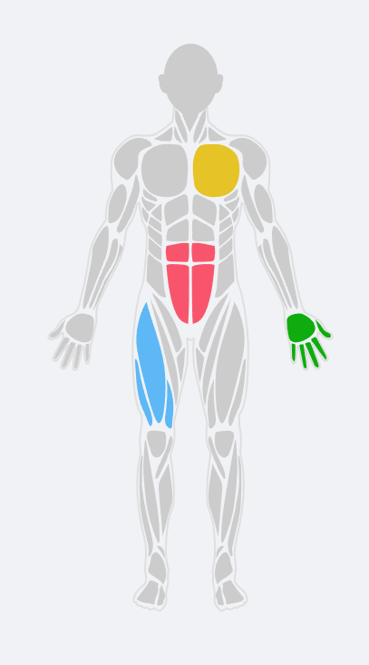
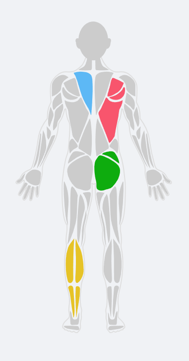

# react-body-map

[](https://www.npmjs.com/package/react-body-map) [](https://www.npmjs.com/package/react-body-map)

> A React component for highlighting parts of the human body.

<div style="text-align:center;width:100%;">
  
  
</div>

## Installation

```bash
pnpm add react-body-map
```

## Usage with Next.js

This package is compatible with Next.js. You'll need to configure your `next.config.js` to transpile `react-native-svg`:

```javascript
/** @type {import('next').NextConfig} */
const nextConfig = {
  transpilePackages: ["react-native-svg"],
};

module.exports = nextConfig;
```

A simple example of how to use the component:

```jsx
import React, { useState } from "react";
import { Body, BodyPart } from "react-body-map";

const App = () => {
  const [selectedParts, setSelectedParts] = useState<BodyPart[]>([]);

  const onBodyPartPress = (part: BodyPart) => {
    setSelectedParts(current => {
        const partIndex = current.findIndex(p => p.slug === part.slug);
        if (partIndex > -1) {
            return current.filter(p => p.slug !== part.slug);
        } else {
            return [...current, { ...part, intensity: 1 }];
        }
    });
  };

  return (
      <Body
        data={selectedParts}
        onBodyPartPress={onBodyPartPress}
      />
  );
};
```

**For a feature-rich example with a notes UI, intensity selection, and more, please see the [example's README](./pages/README.md).**

## Props

| Prop            | Required | Purpose                                                                                                                  |
| --------------- | -------- | ------------------------------------------------------------------------------------------------------------------------ |
| data            | Yes      | `BodyPart[]` - Array of `BodyPart` to highlight.                                                              |
| onBodyPartPress | No       | `Func` - (bodyPart: BodyPart) => {} Callback for when a body part is pressed.                                    |
| colors          | No       | `String[]` - An array of colors to use for intensity levels. Defaults to a four-color scheme.                                     |
| side            | No       | `string` - "front" or "back". Defaults to `front`.                                                                 |
| scale           | No       | `Float` - The scale of the SVG. Defaults to `1`.                                                                                                |

## BodyPart object model

- `slug`: The name of the body part to highlight. See the list below.
- `intensity`: A number from 1 to `colors.length` that determines which color to use.
- `color`: A string to override the intensity color.

## List of body parts

| slug                      |
| ------------------------- |
| abs-upper                 |
| abs-lower                 |
| abs-middle                |
| adductors-left            |
| adductors-right           |
| adductors-left-front      |
| adductors-right-front     |
| adductors-left-back       |
| adductors-right-back      |
| ankles-left               |
| ankles-right              |
| ankles-left-front         |
| ankles-right-front        |
| ankles-left-back          |
| ankles-right-back         |
| biceps-left               |
| biceps-right              |
| calves-left               |
| calves-right              |
| calves-left-front         |
| calves-right-front        |
| calves-left-back          |
| calves-right-back         |
| chest-left                |
| chest-right               |
| deltoids-left-front       |
| deltoids-right-front      |
| deltoids-left-back        |
| deltoids-right-back       |
| feet-left                 |
| feet-right                |
| feet-right-front          |
| feet-left-front           |
| feet-right-back           |
| feet-left-back            |
| forearm-left              |
| forearm-right             |
| forearm-left-front        |
| forearm-right-front       |
| forearm-left-back         |
| forearm-right-back        |
| gluteal-left              |
| gluteal-right             |
| hamstring-left            |
| hamstring-right           |
| hands-left                |
| hands-right               |
| hands-left-front          |
| hands-right-front         |
| hands-left-back           |
| hands-right-back          |
| head-front                |
| head-back                 |
| knees-left                |
| knees-right               |
| lower-back-left           |
| lower-back-right          |
| hips-left                 |
| hips-right                |
| neck-front                |
| neck-left-front           |
| neck-right-front          |
| neck-left-back            |
| neck-right-back           |
| obliques-left             |
| obliques-right            |
| quadriceps-left           |
| quadriceps-right          |
| tibialis-left             |
| tibialis-right            |
| trapezius-left-front      |
| trapezius-right-front     |
| trapezius-left-back       |
| trapezius-right-back      |
| triceps-left              |
| triceps-right             |
| triceps-left-front        |
| triceps-right-front       |
| triceps-left-back         |
| triceps-right-back        |
| upper-back-left           |
| upper-back-right          |
